# Oracle Cloud Infrastructure Fundamentals - Course Notes
Anotações para se preparar para a certificação IZO-1085-23, certificação oficial da Oracle.

    

### 🧭 - Navegação:
2. OCI Overview
4. Identity and Access Management

###
# 2. OCI Introduction

### Aula 01: Overview

**Podemos dividir a infraestrutura da Oracle Cloud em 7 categorias principais**, elas são:

1. Infrastructure;
2. Databases;
3. Data and AI;
4. Analytics;
5. Applications;
6. Governance and Administration;
7. Developer Services.

onde, cada um deles oference os respectivos serviços:

1. **Infrastructure:** Compute, Containers, OS and Vmware, Storage, Networking;
2. **Databases:** Oracle Databases, Distribuited and OSS Databases (NoSQL and MySQL);
3. **Data and AI:** Big Data, AI Services and Messaging; 
4. **Analytics:** Business Analytics;
5. **Applications:** Serverless, App Integration, Business and Industry SaaS;
6. **Governance and Administration:** Cloud Ops, Security and Observability;
7. **Developer Services:** Low Code, AppDev and Infrastructure as Code.

Essas 7 categorias e seus serviços informados são apenas alguns dos 80 serviços disponiveis na Oracle Cloud, mas tudo pode ser experimentado de graça, a Oracle contém um plano que cobra somente 1 centavo por hora (obviamente esse preço varia conforme o uso).

### Aula 02: Arquitetura da OCI.

Nessa aula será apresentado um pouco mais sobre a arquitetura da Oracle Cloud Infrastructure, que irá começar pelas ***"regiões"***.

**Regiões (Regions):** É **uma área geográfica localizada composta de** um ou mais ***domìnios de disponibilidade***.

**Domínios de Disponibilidade (Availability Domains - "AD"):** **São**, um ou mais, **data centers tolerantes a falhas**, **localizados em uma região**, mas **conectados** uns aos outros **por uma rede de largura de banda alta** e **baixa latência**, resumidamente, eles tem as seguintes caracteristicas:

- Tolerancia a falha;
- Localizados em uma região;
- Conectados por uma rede de largura de banda alta;
- e Baixa latência.

**Dominios de Falha (Fault Domains - FD):** São **um agrupamento de hardware e infraestrutura dentro de um dominio de disponibilidade** para fornecer antiafinidade. Pode ser pensado como *data centers lógicos.*

> **Como escolher uma região?**  
 Para escolher uma região primeiro você deve escolher a que está mais próximo dos seus usuários, para uma latencia menor e mais performance.   
 O segundo critério são os "requisitos de residencia e conformidade de dados". Muitos países têm requisitos rigorosos de residência de dados e você deve cumprir com eles. Portanto, escolha uma região com base nesses requisitos de conformidade.   
 E por fim, deve-se levar em conta a disponibilidade do serviço. Novos serviços em nuvem são disponibilizados com base na demanda regional, por motivos de conformidade regulatória, com disponibilidade de recursos e vários outros fatores.   
 Tenha sempre esses 3 critérios para escolher uma região.

#

### Mais sobre cada um

**AD:** **Os *ADs* são isolados um dos outros, tolerantes a falhas e improvável que falhem simultaneamente** (**por não compartilharem uma infraestrutura fisica**, é improvavel que uma falha em um AD impacte nos outros, como na foto abaixo).

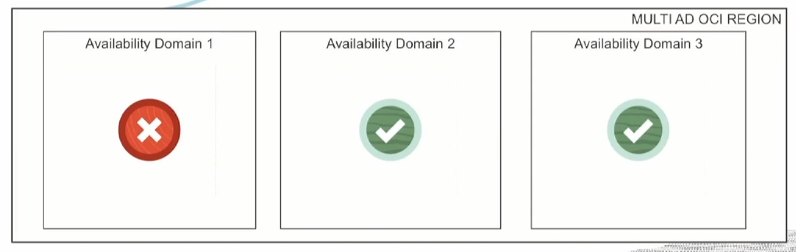

> ***Obs.:*** **Cada** dominio de disponibilidade **(AD) tem 3** dominios de falha **(FD)**, como na foto abaixo.

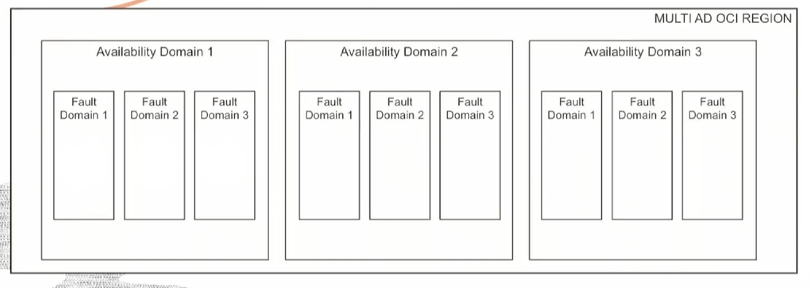

**FD:** São "data centers lógicos" dentro dos *ADs*. A idéia é que você coloque os recursos em diferentes dominios de falha (FD) e eles não compartilham um unico ponto de falha de hardware (como servidores fisicos, switcges, rack fisico e etc.) como na imagem abaixo.

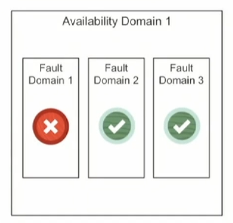

Fazendo isso, você pode obter mais disponibilidade, e aproveitará os FDs corretamente, é claro.

Mas qual seria a recomendação? A recomendação é que temos essas contruções, como dominios de falha e dominios de disponibilidade, nos ajudam a evitar pontos únicos de falha. Portanto, garantimos que tudo seja redundate e com isso, então, caso tenhamos falhas de hardware, diminuimos essas falhas ao máximo possivel.

### Aula 03: Nuvem distribuida no OCI.

Um aspecto exclusivo do Oracle Cloud é o fato dele ser distribuido, isso significa que **os clientes podem ter os serviços do Oracle Cloud de diversas maneiras diferentes**. Isso fornece aos clientes uma flexibilidade de escolha maior.

Os clientes podem obter os serviços Oracle por meio de:

1. **Regiões de nuvem pública** (mais de 41 regiões globais em todo o mundo, com todos os beneficios);

2. **Nuvens Hibridas** como Exadata Cloud@Customer;

3. **Região Dedicada e Nuvem dedicada**;

4. e por fim, **Multinuvem**.

Nessa aula, será analisada um poucos mais sobre híbridos e multinuvem em mais detalhes.

##

### ☁️🌫 - Serviços de Nuvem híbrida

**A primeira oferta de serviço de nuvem hibrida**, da OCI, **é** a **Dedicated Region Cloud@Customer**, **em seguida tem** o servico chamado de: **Oracle Cloud VMware Solution**, logo **na sequencia** tem o serviço: **Autonomous DB (no Exadata Cloud@Customer)** e, **por fim**, existe uma oferta chamada de **Roven Edge Infrastructure**. Abaixo uma explicação um pouco mais simples sobre cada um deles:  

1. **Dedicated Region Cloud@Customer:**   Basicamente, **é uma nuvem privada da Oracle que você instala em seu próprio data center.** Você obtém todos os benefícios da nuvem pública, mas ela está dentro das suas instalações. **É como trazer a nuvem até você.**  

2. **Oracle Cloud VMware Solution:**   Esse serviço **permite que você execute máquinas virtuais VMware** diretamente **na** infraestrutura da **Oracle Cloud.** É uma ponte entre o ambiente VMware tradicional e a nuvem da Oracle, facilitando a migração e a integração.  

3. **Autonomous DB:**   O Autonomous Database **é um serviço de banco de dados totalmente gerenciado pela Oracle.** No Exadata Cloud@Customer, ele é executado em hardware Exadata que fica nas suas instalações. **É ótimo para quem precisa de desempenho excepcional e controle sobre a infraestrutura.**  

4. **Roven Edge Infrastructure:**   Essa é uma parte interessante. Roven Edge Infrastructure **é uma gama de soluções para trazer poder de computação para a borda da rede,** ideal para aplicativos que exigem baixa latência. **É como ter pequenos data centers em locais estratégicos para otimizar a entrega de serviços.**  

### ☁️🔄☁️ - Serviços de Multicloud

Mudando de cenário e indo para os serviços de multinuvem, o primeiro ponto interessante é a **Interconexão OCI-Azure**, que foi lançada em 2019. **A idéia aqui é a Oracle e a Microsoft ter uma interconexão PRIVADA, em execução, entre elas**, como se pode ver na imagem abaixo.

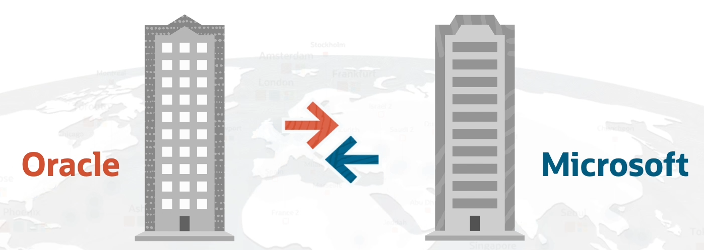

**Até o momento atual** (12/2023), **existe 12 regiões**, no mundo todo, **onde já está disponivel esse serviço de multicloud**, como é possivel ver na imagem abaixo.

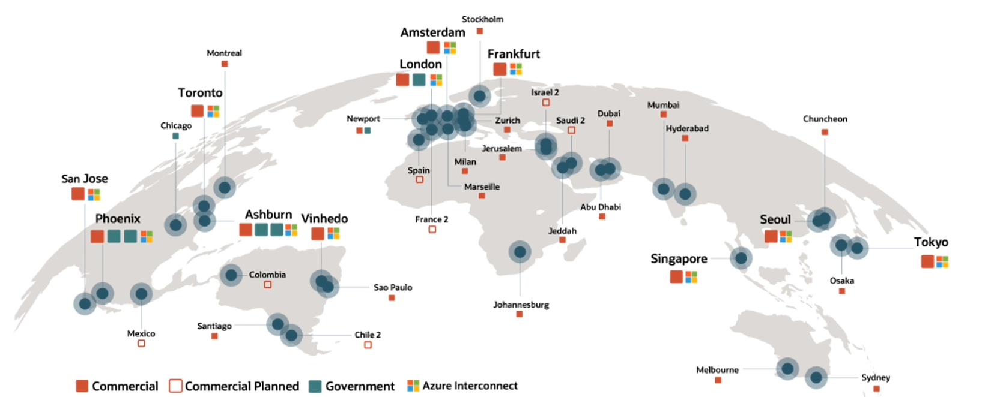

E **por ser uma conexão privada**, podemos assumir que **essa conexão terá uma latência menor que 2 milissegundos**, uma latência muito muito baixa.

> ***Obs.:*** O preço dessa oferta é baseado exclusivamente nos portos e nos circuitos que você provisiona em ambos os lados. **Não há cobrança pela largura de banda (seja de entrada ou saida) consumida.**

###
# 4. Identity and Access Management

### Aula 01: IAM Introduction

**IAM:** **Identity and Access Management**, as vezes também é conhecido como: **controle de acesso refinado** (Fine-grained Access Control) ou **serviço  de controle de acesso baseado em atribuição**

Há dois aspectos principais desse serviço:

1. A primeira é chamada de **autenticação** ou também chamada de **AuthN**;
2. O segundo aspecto é chamado de **autorização** ou também chamado de **AuthZ**.

resumidamente, a **autenticação** tem que **lida**r **com a identidade ou quem é alguem**, **já a autorização** tem que **lida**r **com a permissão** ou o que alguém tem permissão.

***O IAM no OCI consiste de Principal (diretor), Federation (federação) e alguns outros componentes.***

### Dominios de identidade

Os **dominios de identidade são**, como mostra na imagem abaixo, **um container para seus usuários e grupos**.

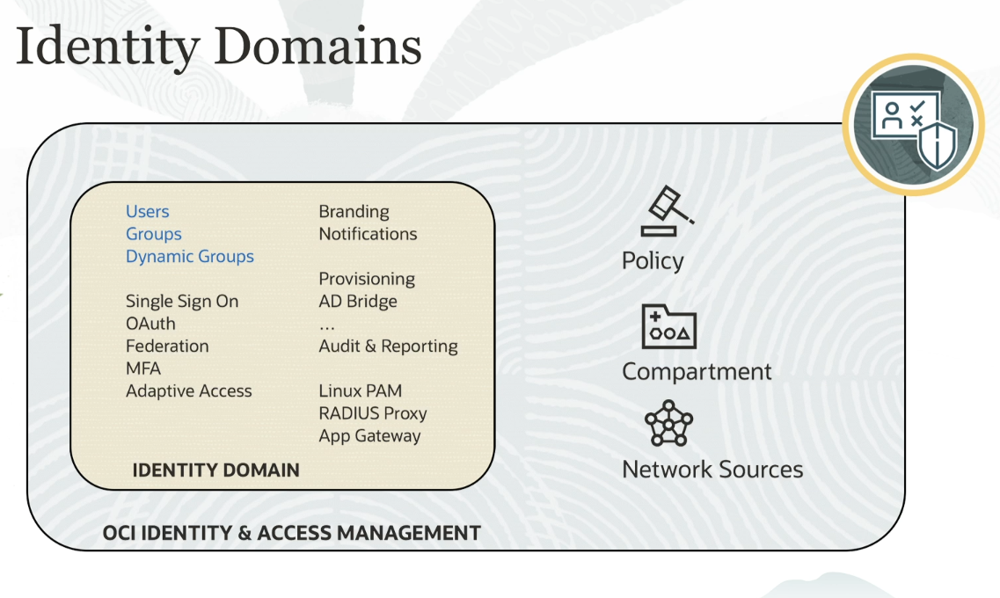

Podemos pensar como uma construção que representa uma população de usuários na OCI e as configurações de segurança associadas.

Na prática, isso funcionaria mais ou menos assim:

1. Deve-se criar os dominios de identidade primeiro;
2. Em seguida, adicionamos os usuários e grupos dentro dos ID;
3. "Setamos" as politicas para esses grupos (onde cada politica tem escopo a uma tenancy, uma conta ou um compartimento);
4. Os recursos estão disponiveis em um compartimento.

> Obs.: Em resumo, **tenancy é como um espaço exclusivo para um cliente dentro da Oracle Cloud Infrastructure, onde eles podem configurar e controlar seus recursos de maneira independente**.

Como na imagem abaixo:

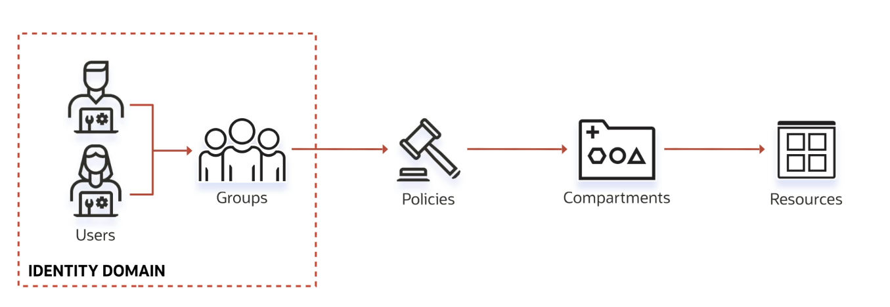

### Como identificar um Recurso OCI?

**A OCI fornece, para cada recurso, o seu próprio identificador**, que é chamado de OCID, **Oracle Cloud ID**.

A sintaxe desse id seria algo parecido com isso:

Ele começa com um **ocid1.tipo do recurso.um realm.região.um id exclusivo**

> Obs.: Realm é, basicamente, o conjunto de regiões que compartilham as mesmas características.

### Aula 02: Compartments

Ao criar uma conta, você adquire um "tenancy" - un nome fantasia para uma conta - e também é fornecido um "compartimento raiz", então podemos pensar nesse "compartimento raiz" em um local lógico que podemos manter todos os recursos em nuvem onde, dentro dele, eu posso criar outros compartimento individuais, que lidam com os recursos de forma isolada.

**A ideia é que você** sempre **crie esses compartimentos para isolamento e controle de acesso** e isso se encaixa até em uma boa prática.

podemos ter uma visão melhor na imagem abaixo:

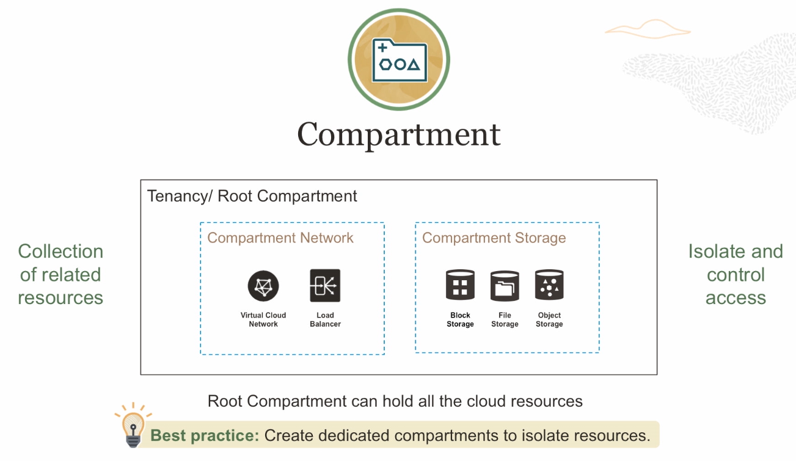

Os recursos presentes em um compartimento não podem ser recriados em outros compartimentos, exemplo:

Em um compartimento A adicionei uma VM, no compartimento B ela não estará presente, e caso eu queira usar uma VM no compartimento B eu preciso mover ela para o compartimento B ou apagar ela do compartimento A e criar ela no compartimento B, como na imagem abaixo:

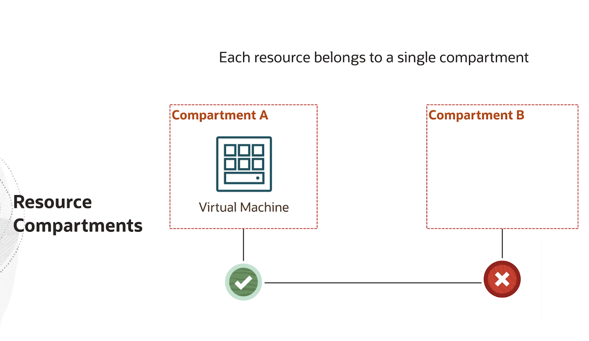

> Obs.: **Mesmo, os recursos, estando em diferentes compartimentos é totalmente suportado a comunicação entre eles**, mesmo estando em compartimentos separados. Exemplo, é possivel ter um compartimento B com um recurso de maquina virtual se comunicando com um compartimento A de Cloud Networking, como na imagem abaixo:

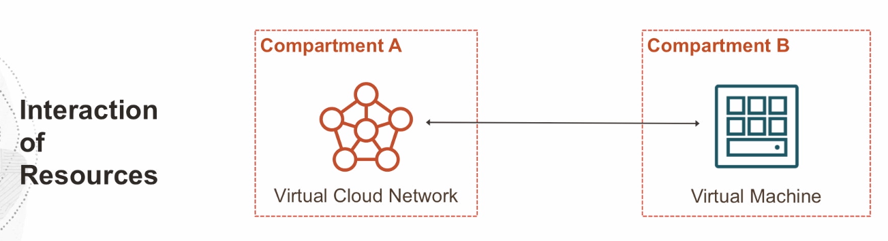

### Aula 04: AuthN and AuthZ

Antes de vermos mais sobre Autenticação (AuthN) e Autorização (AuthZ) precisamos entender que **entidades IAM tem permissão para interagir com recursos OCI**.

> Obs.: **Os grupos de usuários compartilham os mesmos níveis de acesso aos recursos**, então por exemplo: Em determinada infraestrutura, criei um grupo com o nome de "Admins" (grupos ficam dentro dos identity domains), esses "Admins" tem regras de autorização que somente usuários do tipo admin tem e todos esses usuários dentro do grupo tem as mesmas autorizações, afinal estão fazendo parte do mesmo grupo de usuários.

Iremos analisar cada um dos 2 separadamente. Começando pela **AuthN**, essa sigla significa **nada mais, nada menos, que "Autenticação"**, **basicamente ela acaba descrobrindo**, obviamente, **se você é quem você diz que é, igual em todos os sistemas da internet**, afinal, acabamos usando esse tipo de autenticação todos os dias na internet, quando criamos uma conta no Netflix, por exmeplo, e tentamos usar ela, informamos nossas credenciais e confirmamos que nós somos realmente nós (AUHSDUASD).

Quando olhamos para **AuthZ**, que **nada mais é do que "Autorização"**, **ela irá olhar** não só **para** o AuthN (**"você realmente é quem diz ser?"**) mas **também irá olhar para o conjunto de permissões que você tem em determinada infraestrutura**, **no OCI a autorização é feita por meio das políticas de IAM** (é possivel pensar que essas politicas são instruções que definem permissões granulares para os usuários/grupos de usuários).

> Obs.: É importante ressaltar que as **políticas IAM podem ser anexadas a um Compartimento** (o que já era de se imaginar) **ou a um Tenancy** e elas devem, obrigatóriamente, ser atribuidas a um grupo de usuário.

A AuthN no OCI pode ser feita por meio de:

- Username/Password;
- API Signin keys;
- Authentication tokens;

A AuthZ no OCI pode ser feita por meio de:

- IAM policies

### Sintaxe AuthZ

a Sintaxe das políticas IAM para autorização de um determinado grupo para um Tenancy/Compartimento é a seguine:

Em relação a parte "< verb >", **pode existir 4 tipos de verbos**, eles são:

1. **Manage** (Gerenciamento);
2. **Use** (Uso);
3. **Read** (Leitura);
4. **Inspect** (Inspeção).

Agora, **em relação ao "< resource-type >"**, como o nome já fala, **ele enfatiza o tipo do recurso que irá permitir**, o que pode ser todos os recursos, ou seja, tudo que está disponivel na sua conta, seja recursos de computação, banco de dados e etc.

Na tabela abaixo podemos ver o que acabei de falar:

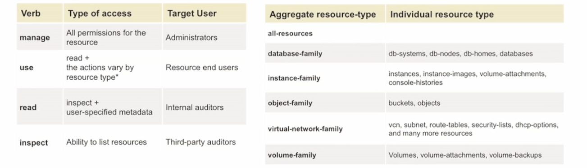

### Aula 06: Tenancy Setup

Com os demos tivemos compreenção que pode existir um Tenancy Admin, e ele é a pessoa responsável pelas operações diárias dessa conta, porém isso não é uma boa prática, a imagem abaixo lista algumas das botas praticas que já falamos até agora:

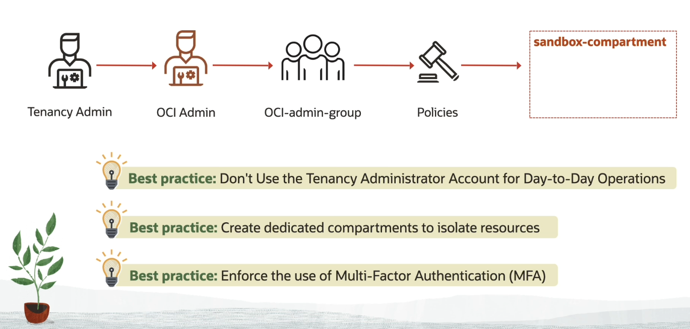
