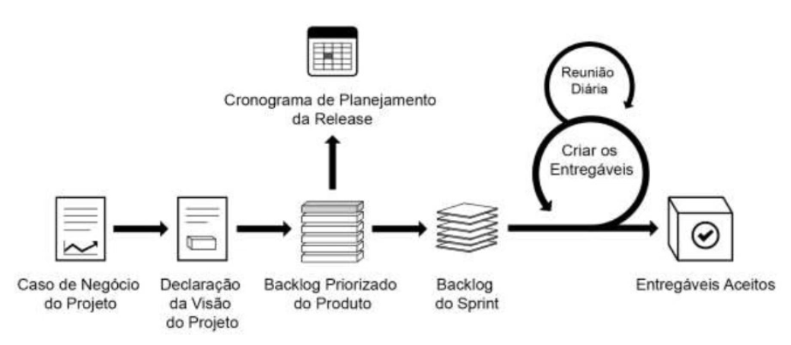

# SCRUM Fundamentals Certified (SFC) - Notes

Anotações para se preparar para a certificação Scrum fundamentals, certificação oficial da SCRUMstudy.

    

#### 🧭 - Navegação (Palestras)

1. Introdução ao SCRUM;
2. Visão Geral;
4. Porque usar SCRUM;

#
## 1. Introdução ao SCRUM

**SCRUM é uma forma de gerenciar projeto**, mas não só projetos em TI (por mais que seja mais comum de se encontrar em projetos relacionados a TI) e sim pra qualquer tipo de projeto, **independente do tipo do projeto ou do tamanho dele, todos os projetos são possiveis ser realizados usando o framework**, principalmente se você tem uma "visão ágil", afinal, o **SCRUM é um framework para gerenciamentos de projetos e se baseia na metodologia ágil**.

#
## 2. Visão Geral

Já falamos anteriormente que o SCRUM é um framework para gerenciamos de projetos que tem suas raizes na metodologia ágil, porém, não acaba por ai. **Dentro do SCRUM temos papeis**, que irá ser falado mais adiante, **e além disso tem alguns processos que devem ser executados para que o SCRUM funcione**. **Seu principal objetivo**, dentro de um projeto, **é entregar mais valor, tanto para o projeto quanto para a empresa**, de forma mais rapida e mais continua e ao mesmo tempo valorizando os profissionais e dando mais agilidade, afinal, os times são auto-organizaveis, é possivel entender como o framework funciona utilizando a imagem abaixo como guia:

#
## 4. Porque usar SCRUM?

Agora que conhecemos um pouco do SCRUM, pelo menos a base de tudo, temos que entender o porque usar o SCRUM, abaixo estão alguns aspectos fundamentais do SCRUM:

1. **"Adaptabilidade"**  **Os principios do SCRUM**, controle de processos empiricos e entrega iterativa **fazem com que os projetos sejam adaptáveis e abertos à incorporação de mudanças**. Quando ocorrem, os processos SCRUM são projetados para aceitar essas mudanças.  

2. **"Transparencia"**  **Quando trabalhamos dessa forma**, construindo entregas com um tempo significativamente menor, **o nosso cliente consegue ver exatamente o que estamos fazendo**, mas ela não é boa somente por isso, ela nos ajuda a construir o produto que o cliente quer, porque **ele consegue ver o que está sendo implementado e pode trabalhar com o time para desenvolver aquilo que ele realmente precisa**.  

3. **"Feedback contínuo"**  **Tanto o cliente como a equipe do projeto se beneficiam a partir do *feedback contínuo***. Em SCRUM, o *feedback contínuo* é fornecido através dos processos denominados como:  
    - Conduzir a Reunião Diária;
    - Demonstrar;
    - e Validar o Sprint.  

4. **"Melhoria contínua"**  **Adaptabilidade e Transparência do SCRUM criam um ambiente de *melhoria contínua***. No decorrer do projeto, **as entregas melhoram progressivamente Sprint por Sprint**, através de mudanças e melhorias que são incluídas e gerenciadas no processo de Refinamento do Backlog Priorizado do Produto.  

5. **"Entrega contínua de valor"**  **Esse é um beneficio adicional que resulta de ser centrado no cliente**. No SCRUM, **os processos iterativos permitem a entrega contínua de valor através do "Processo de Desenvolvimento Eficiente"** cada Sprint produz um produto potencialmente utilizável, serviço ou resultado desejado.  

6. **"Ritmo Sustentável"**  Outro benefício importante é o *rítmo sustentável*. Os processos de SCRUM são projetados de tal forma, que **as pessoas envolvidas trabalham em um ritmo sustentável indefinidamente**.  

7. **"Entrega antecipada de Alto Valor"**  Esse é outro benefício de negócios intimamente relacionado ao uso do SCRUM. Não só é o valor de entrega contínua - **o processo de criação do *Backlog* Priorizado do produto garante que as exigências de maior valor ao cliente sejam atendidas primeiramente**.